

<figure>
    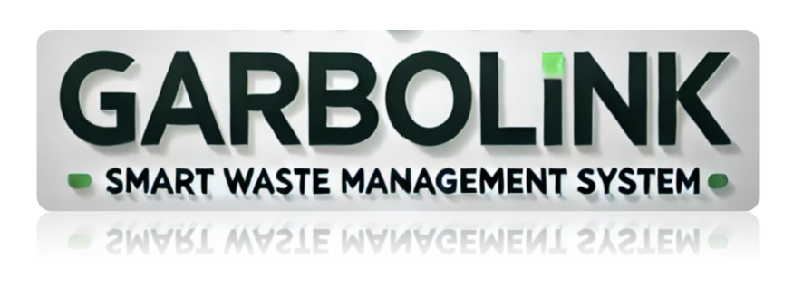
</figure>

# Garbolink - ESE5180-Crazy-Wednesday

## GitHub URL

https://github.com/ese5180/fp-f24-report-website-t01-crazy-wednesday.git

## Team Selection

Team Name: Crazy_Wednesday

| Team Member Name | Email Address       |
|------------------|---------------------|
| Jin Qian         | qian0928@seas.upenn.edu |
| Yining Xia       | ynxia@seas.upenn.edu    |
| Binsheng Zhang   | binsheng@seas.upenn.edu |

## 0 About GarboLink

The GarboLink is an advanced **smart garbage collection system** that integrates IoT, edge computing, and cloud computing to optimize waste management. The system is designed to monitor the trash level and odor level of garbage bins and transmit the data to the cloud. It uses Cellular to ensure seamless connectivity to cloud. The system also aims to provide route planning for garbage trucks, improving efficiency and reducing operational costs.

System Block Diagram:

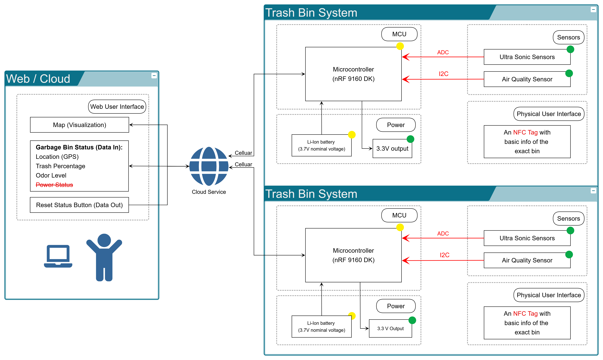

## 1. Evolution of the IoT Venture Pitch: Key Changes Throughout the Project

### 1.1 Target Market & Demographics

#### **Who will be using your product?**

- **Proposal**:  

  Trash bin designed to discreetly contain waste, reduce odors, and promote a cleaner, more pleasant environment.

- **Demo Version**:  

  Targeted for use by property management teams to evaluate its efficiency and suitability in maintaining clean and odor-free facilities.

#### **Who will be purchasing your product?**

- **Proposal & Demo Version**:  

  - **Luxury Communities**: Focused on maintaining neighborhood cleanliness and enhancing overall environmental quality.  

  - **Public Facilities**: Committed to providing tidy environments with smart waste management solutions.

#### **Where in the world (or space!) would you deploy your product?**

- **Proposal & Demo Version**:  

  - **Luxury Communities**: Aiming to enhance neighborhood tidiness and appeal.  

  - **Public Facilities**: Including universities, recreation centers, and amusement parks, where maintaining a clean and welcoming environment is essential.

#### **How large is the market you’re targeting (in US dollars)?**

- **Proposal & Demo Version**:

  **Market Overview**:
  - **TAM (Total Addressable Market)**:  

    The global waste management market was approximately **$1,860.2 billion in 2020**, with potential growth to **$3,498.2 billion by 2032** (CAGR: **5.5%**).

  - **SAM (Serviceable Available Market)**:  
    The smart waste management market was **$2.71 billion in 2024** and is forecasted to reach **$6.28 billion by 2030** (CAGR: **15%**).

  - **SOM (Serviceable Obtainable Market)**:  
    With an estimated **10% market penetration**, the SOM is projected to be **$830 million by 2032**.

  **Supporting Documents**: 

  <figure>
    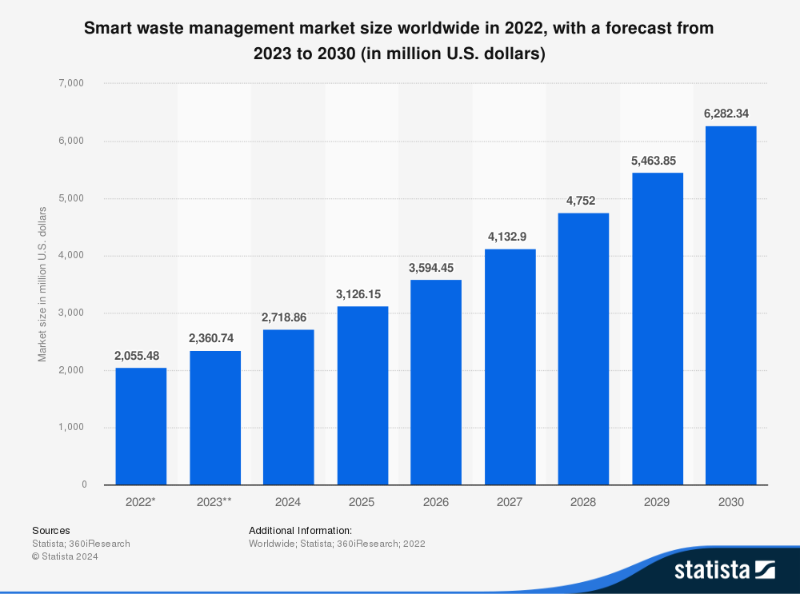
  </figure>

  - [Statista Report: Smart Waste Management Market Size (2022-2030)](https://www-statista-com.eu1.proxy.openathens.net/statistics/1286398/global-smart-waste-management-market-size/)

  - [Research and Markets: Smart Waste Management Forecast (2025-2030)](https://www.researchandmarkets.com/report/smart-waste)

  - [Allied Market Research: Smart Waste Management Market (2032)](https://www.alliedmarketresearch.com/smart-waste-management-market-A08740)

#### **What competitors are already in the space?**

- **Proposal & Demo Version**:

  - Several notable competitors in the smart waste management industry include **Bigbelly** and **Sensoneo**, each offering unique strengths.

  - [**Bigbelly**](https://bigbelly.com/products/bigbelly-solar-smart-compost-bin) specializes in solar-powered waste compactors that reduce bin emptying frequency by increasing bin capacity through compaction. This system is ideal for urban areas and high-traffic locations, leveraging renewable energy to lower both operational costs and environmental impact.

  - [**Sensoneo**](https://sensoneo.com/smart-waste-monitoring/), on the other hand, provides versatile waste level monitoring with both single and multi-sensor options, catering to different bin sizes and types. Known for its advanced route optimization platform, Sensoneo helps waste collection companies minimize fuel costs and emissions by optimizing routes based on real-time fill levels.

  - Garbolink stands out by providing advanced fill and odor tracking with VOC detection fill level monitoring with odor detection which our competitor in the market do not offer. Unlike them, our system runs on a low-power LiPo battery for long life and uses edge processing for data efficiency. We offer cellular network flexibility, ensuring seamless connectivity. While competitors come with additional hardware costs or limitations, Garbolink is not just cost-effective—it's also flexible and priceless."

| **Feature**          | **Garbolink**                                | **Big Belly**                                | **Sensoneo**                                |
|----------------------|-----------------------------------------------|----------------------------------------------|---------------------------------------------|
| **Core Monitoring**  | Fill & odor tracking with VOC detection       | Fill tracking only, no odor detection       | Fill tracking only, no odor detection      |
| **Network Flexibility** | Cellular                                   | Wifi and Cellular only                      | LoRa and Cellular, no Wifi                 |
| **Power Efficiency** | Low-power LiPo battery for long life          | Solar-powered but costly maintenance        | Battery, no solar or low-power options     |
| **Data Efficiency**  | Edge processing                               | Cloud-based data processing. Include Software                                         |
| **Other Features**   | Priceless and flexible                        | Have to buy their Trash Bin                 | Pricy |

---

### 1.2 Security, Hardware, & Software Requirements

#### **Security Requirements Specification (SEC)**

**Overview:**  

This section outlines the security requirements to ensure safe operation and data protection in the smart garbage collection system. The system must safeguard against unauthorized access, ensure data integrity, and maintain confidentiality in communication across sensors, hubs, cloud, and users.

**Definitions and Abbreviations:**  

- **LTE:** Long Term Evolution
 
- **MCU:** Microcontroller Unit  

**Functionality:**

| **SEC ID** | **Requirement**                                                                                     | **Status**                                                                                     |
|------------|-----------------------------------------------------------------------------------------------------|-----------------------------------------------------------------------------------------------|
| SEC 01     | Each device shall be registered with a unique device number on its first activation.                | **Completed:** Each device is registered using a unique ID based on its SIM card information. |
| SEC 02     | Users shall authenticate with secure credentials before accessing the cloud system.                 | **Completed:** Users must log in to access the cloud system.                                  |
| SEC 03     | Data transmitted between devices, hubs, and the cloud shall be encrypted.                           | **Incomplete:** Encryption will be added in future versions.                                 |
| SEC 04     | Sensitive information (e.g., location data, device IDs) shall be stored securely in the cloud.      | **Completed:** Data is stored securely on nRF Cloud and Memfault Cloud.                      |
| SEC 05     | The MCU shall use secure boot to ensure only authenticated firmware can run.                        | **Completed:** A bootloader is used for secure boot.                                          |
| SEC 06     | Firmware updates shall be signed and verified.                                                      | **Incomplete:** Encryption will be added in future versions.                                 |
| SEC 07     | The system shall use NB-IoT for encrypted communication.                                            | **Incomplete:** Encryption will be added in future versions.                                 |
| SEC 08     | Unused ports shall be closed to prevent network vulnerabilities.                                     | **Incomplete:** This feature will be added in future versions.                               |
| SEC 09     | Cloud services shall store backup data to ensure availability and avoid data loss.                  | **Incomplete:** This feature will be added in future versions.                               |
| SEC 10     | Sensors shall compute checksums to verify data integrity before transmission.                       | **Incomplete:** This feature will be added in future versions.                               |
| SEC 11     | The system shall log events such as sensor readings, resets, firmware updates, and user actions.    | **Completed:** Events are logged via terminal and cloud.                                     |

---

#### **Software Requirements Specification (SRS)**

**Overview:**  

This section defines software requirements for the MCU, cloud, and user interfaces, covering communication protocols, data processing, and cloud integration.

**Users:**  

- **Luxury Communities:** Enhance cleanliness and environmental quality.

- **Public Facilities:** Maintain tidy and efficient spaces.

**Definitions and Abbreviations:**  

- **MCU:** Microcontroller Unit

- **LTE:** Long Term Evolution
 
- **VOC:** Volatile Organic Compounds  

**Functionality:**

| **SRS ID** | **Requirement**                                                                                 | **Status**                                                                                |
|------------|-------------------------------------------------------------------------------------------------|------------------------------------------------------------------------------------------|
| SRS 01     | The MCU shall collect sensor data (e.g., garbage level and odor) at configurable intervals.      | **Completed:** Sensor data collection is functional.                                     |
| SRS 02     | The system shall compute garbage and odor levels locally on the MCU.                            | **Completed:** Algorithms implemented based on raw data.                                 |
| SRS 03     | The MCU shall connect to the cloud via NB-IoT.                                                  | **Incomplete:** Switched from NB-IoT to LTE.                                            |
| SRS 04     | On activation, the MCU shall register the bin with a unique device number.                      | **Incomplete:** To be added in future versions.                                         |
| SRS 05     | The cloud shall maintain a database mapping device numbers to locations and statuses.           | **Completed:** Functional on nRF Cloud.                                                 |
| SRS 06     | The cloud platform shall visualize bin data on a map, showing location, trash percentage, etc.  | **Completed:** Visualization functional on a webpage.                                   |
| SRS 07     | The system shall send alerts to workers when bins exceed fill level or odor thresholds.         | **Completed:** Alerts generated when garbage exceeds 75%.                               |
| SRS 08     | The cloud platform shall compute optimal collection routes and send them to drivers.            | **Incomplete:** To be added in future versions.                                         |

---

#### **Hardware Requirements Specification (HRS)**

**Overview:**  

Specifies hardware components for GarboLink, including sensors, microcontrollers, communication modules, and power supplies.

**Definitions and Abbreviations:**  

- **MCU:** Microcontroller Unit 

- **LTE:** Long Term Evolution  

- **VOC:** Volatile Organic Compounds  

**Functionality:**
| **HRS ID** | **Requirement**                                                                                  | **Status**                                                                                  |
|------------|--------------------------------------------------------------------------------------------------|--------------------------------------------------------------------------------------------|
| HRS 01     | Use Nordic nRF9160 DK for data collection and computation.                                       | **Completed:** Functional with two sensors.                                               |
| HRS 02     | Install ultrasonic sensors on the lid to detect trash level with accuracy within 5%.            | **Completed:** Sensors functional within 0-1 meter range.                                  |
| HRS 03     | Use air quality sensor to measure gases like Ethanol and VOC levels up to 500 ppb.              | **Completed:** Measures temperature, humidity, gas resistance, and pressure.              |
| HRS 04     | Capture bin location with accuracy within 50 meters.                                            | **Completed:** Functional with accuracy of 100 meters.                                    |
| HRS 05     | Manage device registration via MCU and assign unique IDs.                                       | **Completed:** NFC tags and SIM-based IDs implemented.                                    |
| HRS 06     | Use NB-IoT to transmit trash and odor data to the cloud.                                         | **Completed:** Switched to LTE for transmission.                                          |
| HRS 07     | Support battery power and low-power modes for energy efficiency.                                | **Incomplete:** To be added in future versions.                                           |
| HRS 08     | Place NFC tags near the lid to assist garbage collectors in bin identification.                 | **Completed:** Functional with distinct messages for two bins.                            |
| HRS 09     | Support garbage bins up to 95 gallons and 45” in height.                                        | **Incomplete:** Demo uses bins with height of 800mm.                                      |

---

### 1.3 Product Function & Components

#### **Power Budget**

- Since frequent data updates are not required for the trash bin system, the device will **operate for 30 minutes per day** with updates occurring every 2 hours. The 30 minutes is because every time you turn on the Air quality sensor, it will run for at least 30 minutes and then turn off.
  
- All other components, including sensors and the MCU, will remain in sleep mode throughout the day, except during the 30 minutes of scheduled operation.

- Assume we are going to use a Lipo battery from Detkin Lab: LP103454, 3.7V, 2000mAh, 7.4Wh

  <figure>
    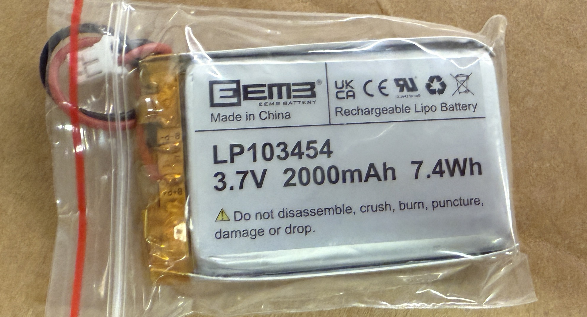
  </figure>

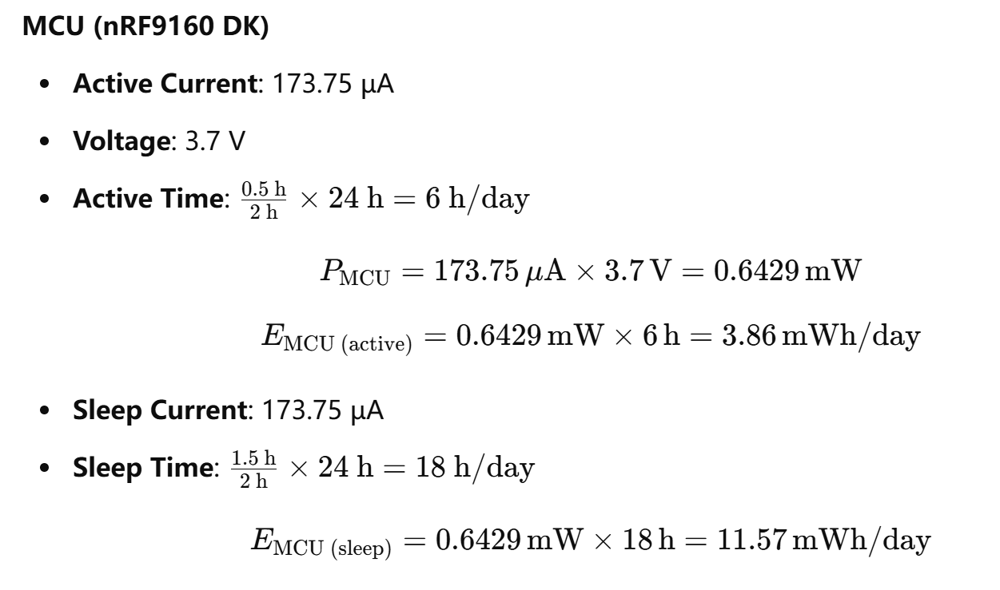

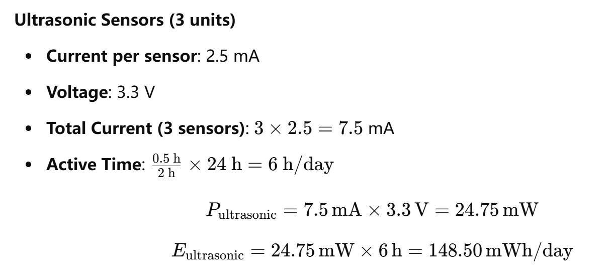

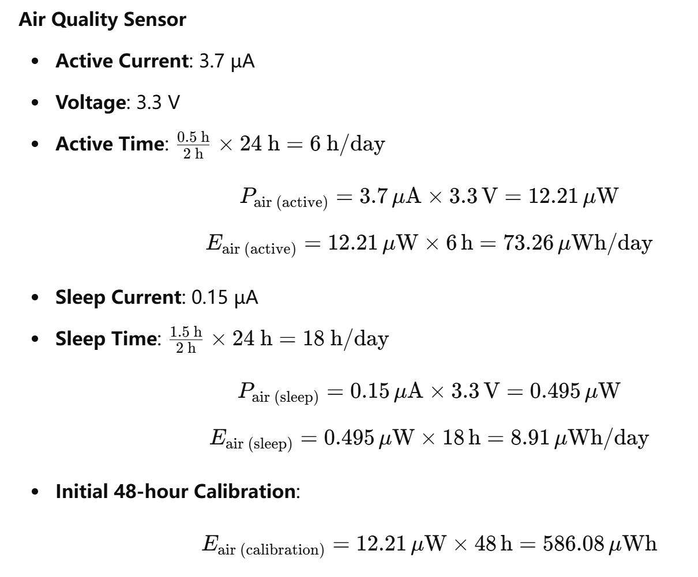

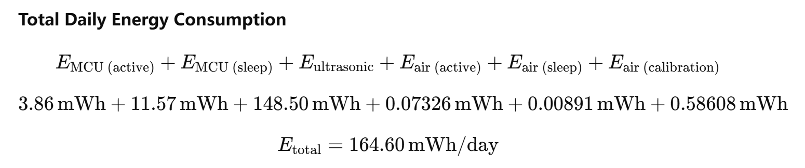

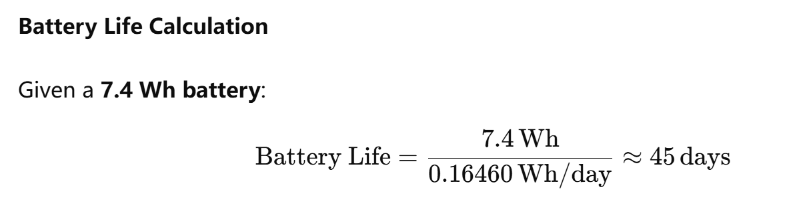

#### **Hardware Costs**

|                           | **Part Name**                    | **Digi-Key Part Number**  | **Unit Price** | **Current**                               | **Voltage**   | **Part Link** |
|---------------------------|----------------------------------|---------------------------|----------------|-------------------------------------------|---------------|---------------|
| MCU                       | Nordic 9160 DK                   | NRF9160-DK-ND             | $155.0         | 175.5 µA (rev1)                           | 3.7V (rev1)   | [NRF9160-DK](https://www.digikey.com/en/products/detail/nordic-semiconductor-asa/NRF9160-DK/9740721) |
| Ultrasonic sensor         | MB1603-000                       | 1863-MB1603-000-ND        | $34.95         | Worst case 3.5 mA at 5V 2.5 mA at 3.3V | /             | [Maxbotix MB1603-000](https://www.digikey.com/en/products/detail/maxbotix-inc/MB1603-000/13422028) |
| Air quality sensor        | SEN-16466                        | 1568-SEN-16466-ND         | $22.50         | Sleep mode: 0.15 µA Worst case: 3.7 µA | 3.3V          | [SparkFun SEN-16466](https://www.digikey.com/en/products/detail/sparkfun-electronics/SEN-16466/12340133) |
| Power                     | 3.7V 2000mAh 103454 Lipo         | Amazon Source             | $12.99         | Peak Load Current 2A                      | 3.7V          | [EEMB 3.7V 2000mAh 103454 Lipo](https://www.amazon.com/EEMB-2000mAh-Battery-Rechargeable-Connector/dp/B08214DJLJ?th=1) |
| NFC                       | 10 Pcs NFC Tags                  | Amazon Source             | $7.99          | X                                         | X          | [NFC Tag](https://www.amazon.com/dp/B075CFXY8V/ref=twister_B09SB4TX18?_encoding=UTF8&th=1) |

The system is going to use 1 ultrasonic sensor, one air quality sensor and an NFC tag for each system. So the total hardware cost for one system is:

$$ 1 * \text{MCU} + 1 * \text{Ultrasonic sensor} + 1 * \text{Air quality sensor} + 1 * \text{Power} +1 * \text{NFC Tag} = 155.0 + 34.95 + 22.50 + 12.99 + 0.35 ≈ 226 $$

Total sensor cost:

$$ 1 * \text{Ultrasonic sensor} + 1 * \text{Air quality sensor}  = 34.95 + 22.50 ≈ 57 $$

#### **Software Costs**

- **NRF Cloud**

  - For the software side, the system needs service for nRF Cloud.

  - The cost breakdown per device is as follows: 
  
    - A registration fee of $0.10 (assuming 1 registration per month)
  
    - Request for location services of $0.001 (assuming 30 requests per month)
  
    - Request for over-the-air (OTA) update of $0.10 (assuming 1 request per month)
  
  - Request for storingg message of $0.0001 (assuming 12 messages stored per day over 30 days). 

  - The total monthly cost per device can be calculated as follows:

$$ \text{Total Cost}=0.1 \text{ (Registration)}+0.001×30 \text{ (Location)}+0.1 \text{ (OTA)}+0.0001×12×30 \text{ (Store Message)}=0.266 $$

  - This results in a total monthly cost of $0.266 per device for using nRF Cloud services.

- **Mobile Data**

  - The system requires mobile data services, and the cost for iBASIS mobile data is $15.85 for 50 MB of data. This cost will be factored into the overall operational expenses, depending on the data usage requirements of the system.

- **The total software costs for one device per month is:**

$$ 0.266  \text{ (NRF Cloud)} + 15.85 \text{ (Mobile Data)} = 16.116 $$

---

## 2. Key Successes: What Went Well and Why?

- One of the key successes of our project was the successful integration of multiple complex technologies, including Nordic's hardware platform, the Zephyr RTOS, LTE connectivity, nRF Cloud services, and Memfault for monitoring and debugging. This integration demonstrates our ability to effectively combine cutting-edge tools and frameworks into a cohesive and functional system.

- Additionally, we successfully built and deployed our code across different Windows operating systems, including Windows 10 and Windows 11, as well as under various system configurations. This ensures the portability and robustness of our development environment, making it adaptable for different users and setups.

- These accomplishments are significant because they highlight not only our technical expertise but also our attention to compatibility and usability. By ensuring the seamless integration of diverse components and achieving consistent builds across platforms, we have created a reliable and scalable foundation for further development and deployment of our system.

## 3. Challenges and Lessons Learned: What Didn’t Go Well and Why?

- Our project’s security implementations did not progress as intended, primarily due to time constraints, complexity, and a lack of dedicated expertise. While we initially aimed to encrypt data transmissions, verify signed firmware updates, and implement secure boot features, these measures were repeatedly deprioritized as we focused on foundational functionality and reliable system integration. 

- The advanced nature of embedded security, along with the learning curve involved, made it difficult to address these goals effectively within our limited timeframe. Consequently, many planned security enhancements remained incomplete or only partially realized by the end of the project.

## 4. Optimizing Development: Lessons for Future Approaches with Limited Time and Resourcesa

- If we had to do it again, we would make several adjustments to our development approach to maximize the use of finite time and resources.

- First，we would incorporate additional sensors to gather more comprehensive data for determining when garbage collection is necessary. For example, using weight sensors could provide valuable insights into the actual contents of the bin. Lightweight materials like cardboard may take up significant volume but have a lower priority for collection. By combining data from volume sensors with weight measurements, we could make more informed decisions and optimize waste collection routes.

- Second, we would consider using a more flexible cloud platform, such as AWS. While nRF Cloud provided a simple and efficient solution for our use case, its limitations in building customizable front-end applications restricted our ability to create a more advanced and interactive interface. Platforms like AWS offer modular components and greater flexibility, which could allow for more sophisticated data visualization and user interaction.

- Finally, we would allocate more resources to building a scalable and user-friendly front-end platform. With a more robust cloud service, we could deliver a better user experience, showcasing real-time data and analytics in a visually engaging manner.

- These changes would enhance the functionality and scalability of the system, providing better decision-making tools and an improved overall user experience. However, they would need to be balanced carefully against time and budget constraints to ensure feasibility.

## 5. Refining the System: Potential Design Changes Post-Development

### 5.1 Was your wireless communication protocol the correct choice?

- Yes, I believe cellular was the correct choice for our wireless communication protocol. Cellular connectivity ensures that our system can communicate reliably in nearly any location, which is critical for use cases where coverage is a priority. Unlike other wireless communication protocols such as Wi-Fi or Bluetooth, cellular networks provide broad geographic coverage without the need for additional infrastructure, making it ideal for applications like ours.

- However, this choice does come with trade-offs. One of the main challenges is the added cost of purchasing mobile data plans, which can increase operational expenses, especially as the system scales to more devices. Despite this, the benefits of ubiquitous connectivity outweigh the costs, as it ensures that the system remains functional in diverse environments, including remote or rural areas where other communication methods may be unavailable.

### 5.2 Would other sensors or actuators work better?

- Yes, other sensors could potentially work better for our system. For example, replacing the ultrasonic sensors with cameras could significantly improve the accuracy of identifying the garbage percentage in a bin. Cameras, combined with image recognition algorithms, can provide detailed insights into the type and volume of waste. This would enable the system to differentiate between various materials, such as cardboard, plastic, or organic waste, and calculate the bin's fullness more precisely.

- While cameras would introduce additional complexity in terms of data processing and potentially higher power consumption, the increased accuracy and flexibility they offer could justify the trade-off. This approach could also open the door to future features, such as categorizing waste for recycling purposes or integrating advanced analytics for waste management optimization.

- Overall, transitioning to camera-based sensors would enhance the system’s functionality and provide more actionable data for decision-making.

### 5.3 Did your target market want something different?

- Our target market appears to value the core functionality we provided, but there are areas where their needs might differ from our current implementation. For example, while our system focuses on measuring bin fullness and optimizing waste collection, some potential users expressed interest in additional features such as waste categorization for recycling, real-time notifications for bin maintenance, or predictive analytics to forecast when bins will be full based on historical data.

- Additionally, some users may prefer a solution with a more customizable and visually engaging interface, which could be better supported by using a more flexible cloud platform like AWS instead of nRF Cloud. This would allow us to provide tailored dashboards and integrations that align more closely with the specific needs of different customers.

- Finally, cost sensitivity might influence some customers' decisions. They may want a system that minimizes ongoing operational costs, such as mobile data expenses, even if it means a trade-off in connectivity or functionality. Offering hybrid communication options or optimizing data usage could address this concern.

- In future iterations, aligning more closely with these desires could enhance the appeal and adoption of our system within the target market.

---

## In addition to these questions, include evidence of your product working

### 1. Images of your MVP device

  <figure>
    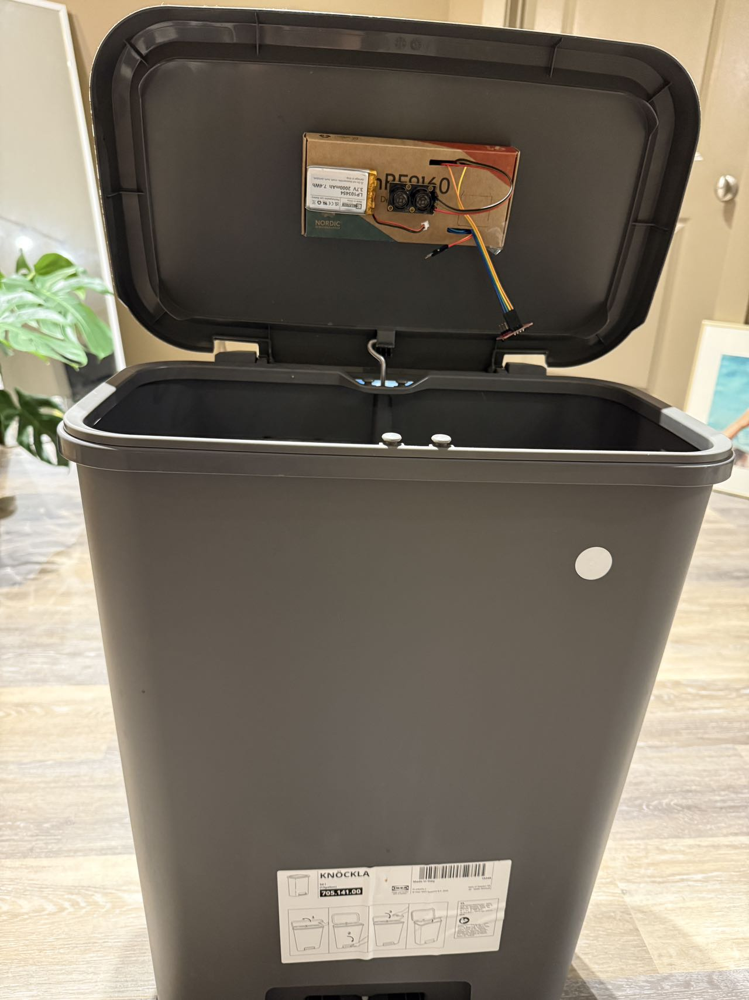
  </figure>

### 2. A video demonstrating your Core Product Function and Memfault integration features

[Watch our video on YouTube](https://youtu.be/L2EH9ioGY6c)

### 3. Anything else you think is relevant to the project

  <figure>
    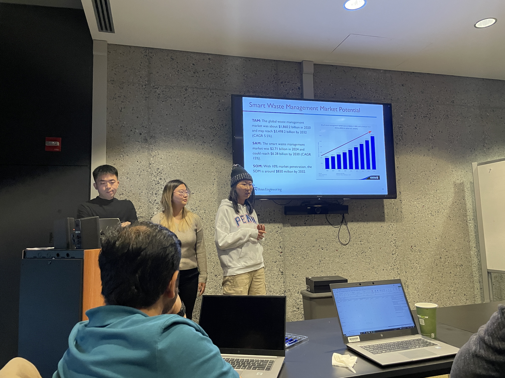
  </figure>

  <figure>
    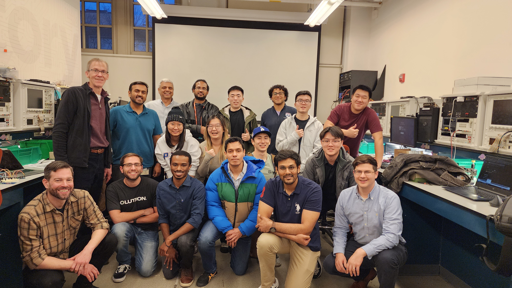

